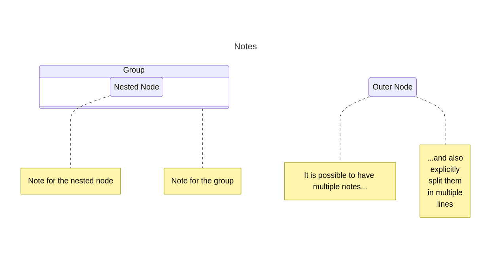

# State & Activity (Flowcharts) Diagrams

### Supported DSLs

|                  | Mermaid                                                                          | PlantUML         | Graphviz                                                                                  |
|------------------|----------------------------------------------------------------------------------|------------------|-------------------------------------------------------------------------------------------|
| Any limitations? | a) Styling not supported for the elements inside the groups ("composite states") | ✅ No limitations | a) No orientation support for graphs with elements inside the groups ("composite states") |

For more details about the supported DSLs, please refer to the next links:

- [Mermaid](https://mermaid.js.org/)
- [PlantUML](https://plantuml.com/)
- [Graphviz](https://graphviz.org/)

### Quick Start

Both State and Activity diagrams (aka Flowcharts) are used to represent some complex process that has a direction
and certain granular "units" within the context of this process.

If we are talking about the State diagrams, such units are the "states" of some system and the diagram represents the 
process of transitions through these states.

If we are talking about the Activity diagrams, such units are the "actions" of some process.

But in both cases the representation can be reduced to the directed graph, so the same graphical elements can be re-used
for the visual representation.

*NB!* because of the different meaning put into the State and Activity diagrams, the simple directed graph itself 
might not be good enough to properly describe the complex and feature-rich 
system. So, in order to keep things simple, only the common visual elements suitable for both State and Activity diagrams
will be implemented. 
Thereby the visual elements like [activity partitions](https://www.uml-diagrams.org/activity-diagrams.html#partition) 
for Activity diagrams or the 
[history pseudostates](https://www.uml-diagrams.org/state-machine-diagrams.html#pseudostate) for State diagrams, and other specific elements will 
not be considered for the implementation. 

### Quick Start

Every state of activity diagram describes some scenario of transitions from state to state, 
or from action to action, correspondingly.

Hereinafter in this documentation both diagrams will be referred to as just "graph" diagrams. 
The simplest example to generate a very basic graph diagram:

```python
from umlcharter import GraphDiagram, Mermaid

# define the instance of the diagram class, name the diagram and define the DSL being used
gd = GraphDiagram("Basic Example", Mermaid)

# define the nodes inside the graph
first = gd.node("First")
second = gd.node("Second")

# write the transitions
first.go_to(second, "From first to second")
second.go_to(first, "And return back to the first")

# generate the diagram as a code in a chosen DSL
print(gd)
```

The python code from above will print out the following code in [Mermaid](https://mermaid.js.org/) DSL:

```text
---
title: Basic Example
---
stateDiagram-v2
state "First" as n2
state "Second" as n3
n2 --> n3 : Do something sketchy
n3 --> n2 : And return back
```

which in turn can be rendered to this image:


Simple, is not it? Now let's take a deeper look.

So, to draw our beautiful diagram, we had to first

- choose the title
- choose the DSL
- and name the nodes inside the graph

In the example from above
```python
from umlcharter import GraphDiagram, Mermaid

# define the instance of the diagram class, name the diagram and define the DSL being used
gd = GraphDiagram("Basic Example", Mermaid)

# define the nodes inside the graph
first = gd.node("First")
second = gd.node("Second")
```

We have chosen the `"Basic Example"` to be our title, chosen `Mermaid` as a DSL to generate the diagram as a code and
defined two nodes titled `"First"` and `"Second"` that can be the representation of some actions or states

Then we have defined the flow of transitions using the method `got_to`. In our example
```python
first.go_to(second, "From first to second")
second.go_to(first, "And return back to the first")
```
we have stated that we are going from the `"First"` to the `"Second"` and then going back.

Also, the result of these calls indicating the transition from node to node is the node was targeted in the call, so you can chain the lines from above as this:

```python
first.go_to(second, "From first to second").go_to(first, "And return back to the first")
```
with the same results.

### Default top-bottom direction

In the graph diagram you are not focusing on the positioning of the nodes inside the graph, but rather on the nodes themselves and the transitions between them
(or, how it is correctly called "edges" or "links"). However, the rendering implementation regularly expects that the user
can define a base orientation of the graph, and by default the orientation is vertical and chosen flow direction is "from top to bottom".

However, it can be changed by setting the value of the argument `is_vertical` passed to the constructor of the `GraphDiagram` instance.
By setting it to `False` the orientation will be changed from vertical to horizontal, and the base flow direction will be "from left to right":

```python
from umlcharter import GraphDiagram, Mermaid

# vertical orientation, from top to bottom
gd_from_top_to_bottom_1 = GraphDiagram("From Top to Bottom", Mermaid)
gd_from_top_to_bottom_2 = GraphDiagram("From Top to Bottom", Mermaid, is_vertical=True)

# horizontal orientation, from left to right
gd_from_left_to_right = GraphDiagram("From Left to Right", Mermaid, is_vertical=False)
```

A more complex example displaying the different orientation:
```python
from umlcharter import GraphDiagram, Mermaid, PlantUML, Graphviz

for dsl in (Mermaid, PlantUML, Graphviz):
    for is_vertical in (True, False):
        gd = GraphDiagram(f"Orientation:\n{'Vertical' if is_vertical else 'Horizontal'}", dsl, is_vertical=is_vertical)
        a = gd.node("A")
        b = gd.node("B")
        x = gd.node("X\n(connects to nothing)")
        e = gd.node("E")

        a.go_to(b, "From A\nto B")
        a.go_to(e, "From A\nto E")
        e.go_to(b, "From E\nto B")
        e.go_to(a, "From E\nto A")

        print(gd)
```


| DSL      |      Visualization (vertical orientation)       | Visualization (horizontal orientation)            |
|----------|:-----------------------------------------------:|:--------------------------------------------------|
| Mermaid  |    |    |
| PlantUML |   |   |
| Graphviz |   |   |


### Styling

It is possible to define the color of diagram elements
to improve its readability or emphasize certain areas.
Nodes and group of nodes support the positional argument
`color` used to accept the hexadecimal code of the color that should be applied to the element.

For more specific examples and extended functionality, please refer to the rest of the document:

<details>
<summary><h3>Containers / Composite States</h3></summary>

In graph diagrams the nodes can be organized in the containers. In the context of state diagrams such groups represent the "composite state", 
some container of some smaller or intermediate states that can be aggregated into the larger entity for the easier modelling and analysis.
Similar meaning applicable to the activity diagram where these groups depict the set of encapsulated activities that in the 
larger scale can be interpreted as a single large meaningful single action.

To define such container of nodes, you have to just have to create a new `node` from the already existing one. 
Then this already existing one becomes a container for the other nodes.

_NB: nodes within the graph can interact with each other only within the same level. 
It means if you have a container of nodes, then these nodes inside the container can interact with each other, 
but cannot interact with the nodes outside of it._

```python
from umlcharter import GraphDiagram, Mermaid, PlantUML, Graphviz

for dsl in (Mermaid, PlantUML, Graphviz):
    gd = GraphDiagram("Containerized Nodes", dsl)
    green_color = "769D8F"
    container = gd.node("Group", color=green_color)
    node = gd.node("Node", color=green_color)
    nested_node = container.node("Nested Node")
    nested_container = container.node("Nested Group", green_color)
    nested_container.node("Deeply Nested Node", green_color)
    container.go_to(node, "A link")
    nested_node.go_to(nested_container, "Go deeper!")
    print(gd)
```

| DSL      |                                                                                               Visualization                                                                                                |
|----------|:----------------------------------------------------------------------------------------------------------------------------------------------------------------------------------------------------------:|
| Mermaid  |                                          ❌ Styling of the nested elements is not supported at the moment of writing ❌<br/>                                           |
| PlantUML |                                                                                                                                                                     |
| Graphviz | ❌ Orientation of the graph is not supported for the graphs with containers, because layout "fdp" does not support it ❌<br/>                                         |

</details>

<details>
<summary><h3>Start & Finish</h3></summary>

Within the graph you can use the special abstract nodes `start` and `finish` that are the ultimate and explicit nodes 
used to identify the very beginning and the end of the flow described in the graph.

These `start` and `finish` are available at any level, including the containers.

_NB: because these nodes does not have any inner meaning except being just some kind of anchors,
the direct link between `start` and `finish` is not possible because it is meaningless. Because of the similar reasons it is
also not allowed to define the `start` as the destination for the transition between states. 
And you cannot use `finish` as the start of the transition._

```python
from umlcharter import GraphDiagram, Mermaid, PlantUML, Graphviz

for dsl in (Mermaid, PlantUML, Graphviz):
    gd = GraphDiagram("Start & Finish", dsl)
    node = gd.node("Node")

    # top-level graph start & finish:
    gd.start.go_to(node).go_to(gd.finish)

    container = gd.node("Group of nodes")
    nested_node = container.node("Nested Node")

    # container-level start & finish
    container.start.go_to(nested_node).go_to(container.finish)

    gd.start.go_to(container).go_to(gd.finish)
    print(gd)
```

| DSL      |                                                                             Visualization                                                                              |
|----------|:----------------------------------------------------------------------------------------------------------------------------------------------------------------------:|
| Mermaid  |                                                                                                                               |
| PlantUML |                                                                                                                              |
| Graphviz | ❌ Orientation of the graph is not supported for the graphs with containers, because layout "fdp" does not support it ❌<br/>  |

</details>

<details>
<summary><h3>Fork & Join</h3></summary>

The special methods `fork` and `join` can be used to define the special "fork" and "join" used do describe the 
beginning and the end of the parallel processes correspondingly.

```python
from umlcharter import GraphDiagram, Mermaid, PlantUML, Graphviz

for dsl in (Mermaid, PlantUML, Graphviz):
    gd = GraphDiagram("Parallel Processes", dsl)
    a = gd.node("A")
    b = gd.node("B")
    c = gd.node("C")
    d = gd.node("D")
    fork = gd.fork()
    join = gd.join()

    # split the flow
    a.go_to(fork, "Fork the process")
    fork.go_to(b, "These transitions\nare happening...")
    fork.go_to(c, "... simultaneously")

    # join the flow
    b.go_to(join)
    c.go_to(join)

    join.go_to(d, "The flow has been synchronized")
    print(gd)
```

| DSL      |             Visualization              |
|----------|:--------------------------------------:|
| Mermaid  |   |
| PlantUML |  |
| Graphviz |  |

</details>

<details>
<summary><h3>Condition</h3></summary>

To define the conditional node that can control the direction of the flow, you can use method `condition`:

```python
from umlcharter import GraphDiagram, Mermaid, PlantUML, Graphviz

for dsl in (Mermaid, PlantUML, Graphviz):
    gd = GraphDiagram("Condition", dsl)
    initial = gd.node("You are a\nsweet-tooth")

    # offer different sweets
    condition1 = gd.condition()
    gd.start.go_to(initial).go_to(condition1, "What would you like?")

    # ice cream
    ice_cream_offer = gd.node("Vanilla ice cream 🍨")
    condition1.go_to(ice_cream_offer, "What about cold ice cream?")
    eat_ice_cream = gd.node("Eat ice cream")
    ice_cream_offer.go_to(eat_ice_cream)
    eat_ice_cream.go_to(gd.finish)

    # chocolate + second condition
    chocolate_offer = gd.node("Chocolate 🍫")
    condition1.go_to(chocolate_offer, "Or maybe some fine chocolate?")
    eat_chocolate = gd.node("Eat chocolate")
    condition2 = gd.condition()
    chocolate_offer.go_to(condition2, "Are you sure?")
    condition2.go_to(eat_chocolate, "Definitely")
    condition2.go_to(condition1, "Hmm,\nlet me think again...")
    eat_chocolate.go_to(gd.finish)

    print(gd)
```

| DSL      |              Visualization              |
|----------|:---------------------------------------:|
| Mermaid  |   |
| PlantUML |  |
| Graphviz |  |

</details>

<details>
<summary><h3>Notes</h3></summary>

To provide commentaries or notes regarding certain parts of the process described in the graph, 
the special method `note` can be used.
This method will attach the special separate note to the generated diagram, associated with the 
element of the graph used to call this method.
The notes can be added to:
- nodes
- groups of nodes
- forks and joins
- conditions

```python
from umlcharter import GraphDiagram, Mermaid, PlantUML, Graphviz

for dsl in (Mermaid, PlantUML, Graphviz):
    gd = GraphDiagram("Notes", dsl)
    group = gd.node("Group")
    nested_node = group.node("Nested Node")
    node = gd.node("Outer Node")

    group.note("Note for the group")
    nested_node.note("Note for the nested node")
    node.note("It is possible to have multiple notes...")
    node.note("...and also\nexplicitly\nsplit them\nin multiple\nlines")

    print(gd)
```

| DSL      |                                                                          Visualization                                                                          |
|----------|:---------------------------------------------------------------------------------------------------------------------------------------------------------------:|
| Mermaid  |                                                                                                                               |
| PlantUML |                                                                                                                              |
| Graphviz | ❌ Orientation of the graph is not supported for the graphs with containers, because layout "fdp" does not support it ❌<br/>  |

</details>